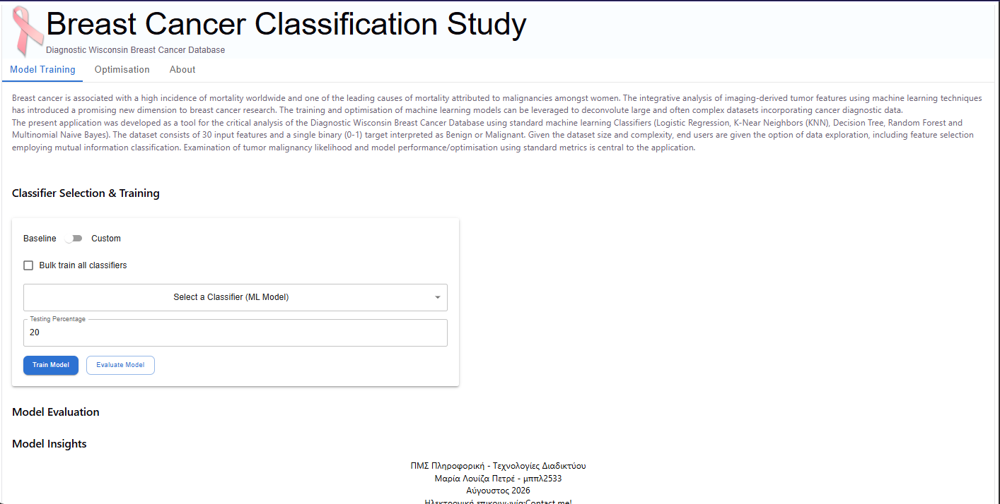
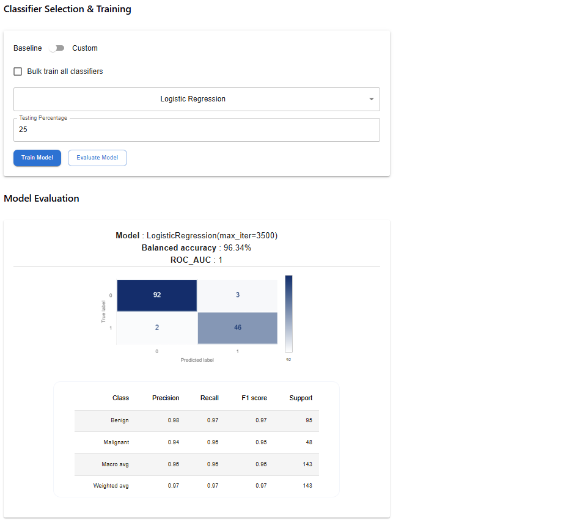
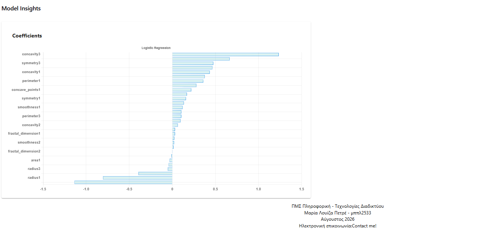

## Getting started 

This application was designed to allow interested users to probe the Wisconsin Breast Cancer dataset.
Specifically users can: 
- Train baseline or custom-configured classifiers on the  dataset
- Evaluate trained models on standard metrics ( e.g. accuracy, ROC AUC, confusion matrix, classification report)
- Run feature selection via mutual information scoring, optionally retraining on the top-N features
- Compare an original model against a feature-optimised version side by side
- Inspect model-specific insights (feature importances, coefficients, or configuration, depending on the classifier)

## Backend structure

```
main.py               FastAPI app, route definitions, CORS
data.py                load_data(), encode_target()
models.py              split_the_data(), build_models(), fit_models(),
                       build_custom_model(), permitted_params
my_models.py           save_trained_models(), load_trained_models()
evaluation.py          evaluate_models(), retrieve_insights()
feature_selection.py   feature_selection(), keep_top_n()
```
### API endpoints

| Method | Path | Purpose |
|---|---|---|
| `POST` | `/train/baseline` | Train one or all baseline classifiers |
| `POST` | `/train/custom` | Train a single classifier with custom hyperparameters |
| `GET` | `/models` | Return permitted hyperparameters per model |
| `GET` | `/evaluation?filename=` | Evaluate a saved model file (default `savedmodels.pkl`) |
| `POST` | `/features/top_n?n=&save_features=&retrain=` | Run mutual-information feature selection; optionally save features and/or retrain on the top-N subset |

## Frontend structure

```
App.jsx                    Main "Model Training" tab — train/evaluate baseline models
Optimisation.jsx           "Optimisation" tab — feature selection, retraining, comparison
About.jsx                  About tab
matrix.jsx                 ConfusionMatrix component (chartjs-chart-matrix)
Classification_report.jsx  ClassificationReport component (MUI table)
FeatureImportanceChart.jsx Horizontal bar chart for model insights
hero.jsx / footer.jsx       Page chrome
```
## Example images (Frontend)

### Logistic Regression Example


